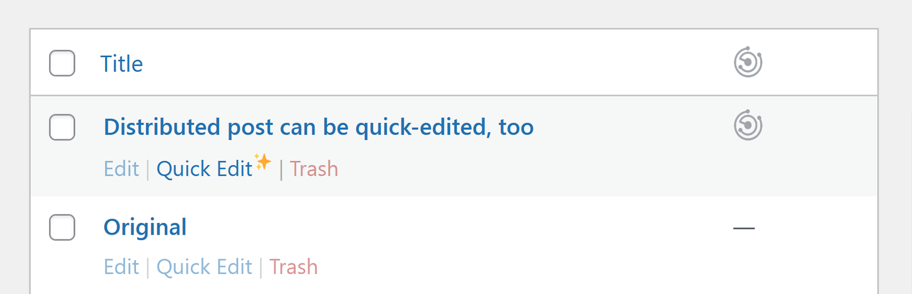

# Distributor - Remote Quickedit

Stable tag: 0.2.1  
Requires at least: 5.1.0  
Tested up to: 6.1.1  
Requires PHP: 7.0  
License: GPL v3 or later  
Tags: distributor, quickedit  
Contributors: carstenbach  

Re-enable quickedit for distributed posts.

## Description

Re-enable quickedit for distributed posts on the receiving site within a multisite network. This allows you to make changes to the original post from the remote site. This is a small add-on for the glorious [Distributor](https://distributorplugin.com/) plugin by *10up*.

This Add-on is maintained at and deployed from [carstingaxion/distributor-remote-quickedit](https://github.com/carstingaxion/distributor-remote-quickedit) on github. 

### Features

 * Use native WordPress quickedit on the receiving side of a distributed post to make minor changes, which is disabled by the *Distributor*-plugin by default.

### Compatibility

This plugin is an add-on, it requires:

* Distributor ([Website](https://distributorplugin.com/)|[GitHub](https://github.com/10up/distributor))

### Usage

***This plugin does nothing by default.***

Being able to modify posts, that were syndicated from a remote source, is a risky thing. To prevent any unwanted side-effects you have to pro-actively enable this plugin by code.

In order to re-enable the quick-edit functionality for a particular post_type you need to call `add_post_type_support()` for a support-feature called *`distributor-remote-quickedit`*. Do this for every desired post_type before this plugin loads. 

With a post_type of `book`, you could do it like so:

~~~php
add_action( 'admin_init', function () {
	add_post_type_support( 'book', 'distributor-remote-quickedit' );
}, 9 );
~~~

**It's important to declare your post_type_supports before the plugin is executed on `admin_init` with a default priority of `10`!**

## Frequently Asked Questions

### Does this plugin work with WordPress Multisite?

Yes, it is made for multisites with internal distribution setup.

### The Distributor plugin disables the use of quickedit for reasons. Why would I want to change that?

It totally depends on your use case ;)

In our case, on a large multisite network, there was only one out of almost 20 post_types, that needed this *feature*, for sure - real-world-use-cases may be rare.

<!-- changelog -->
